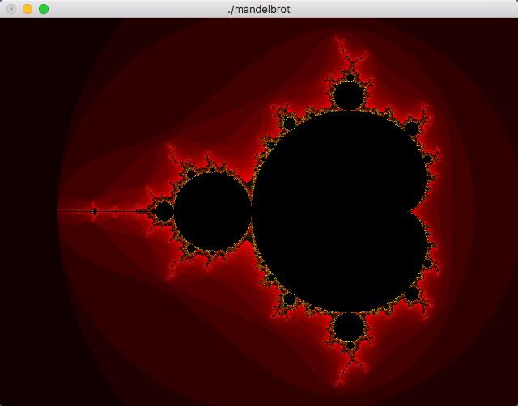
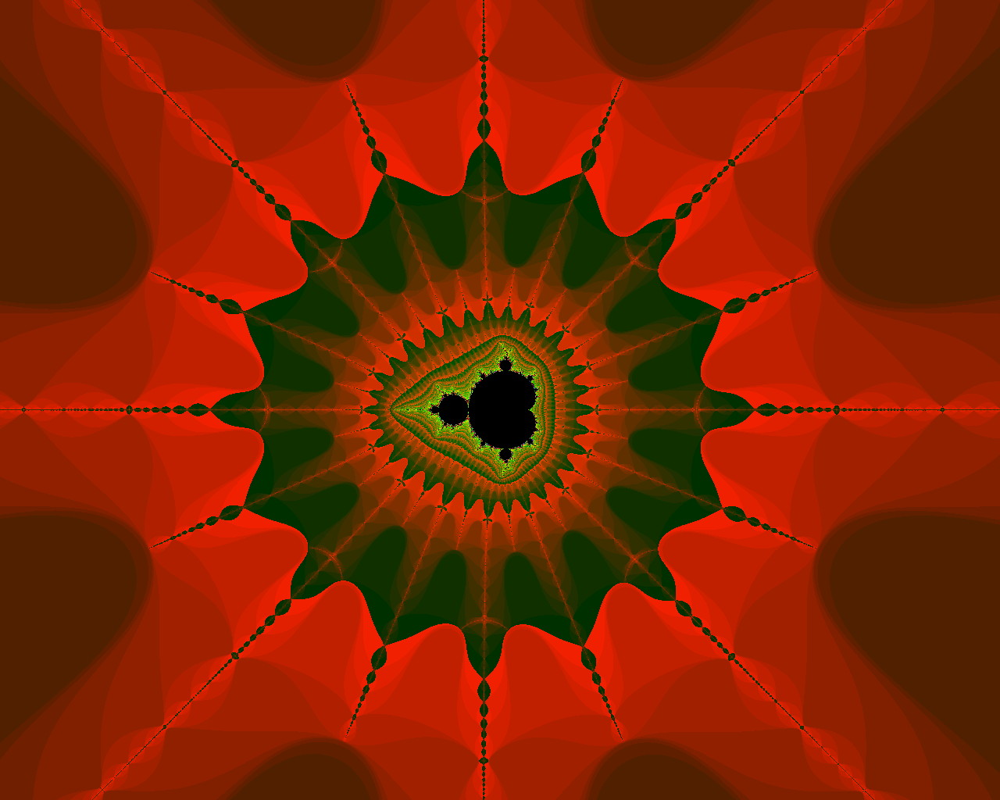
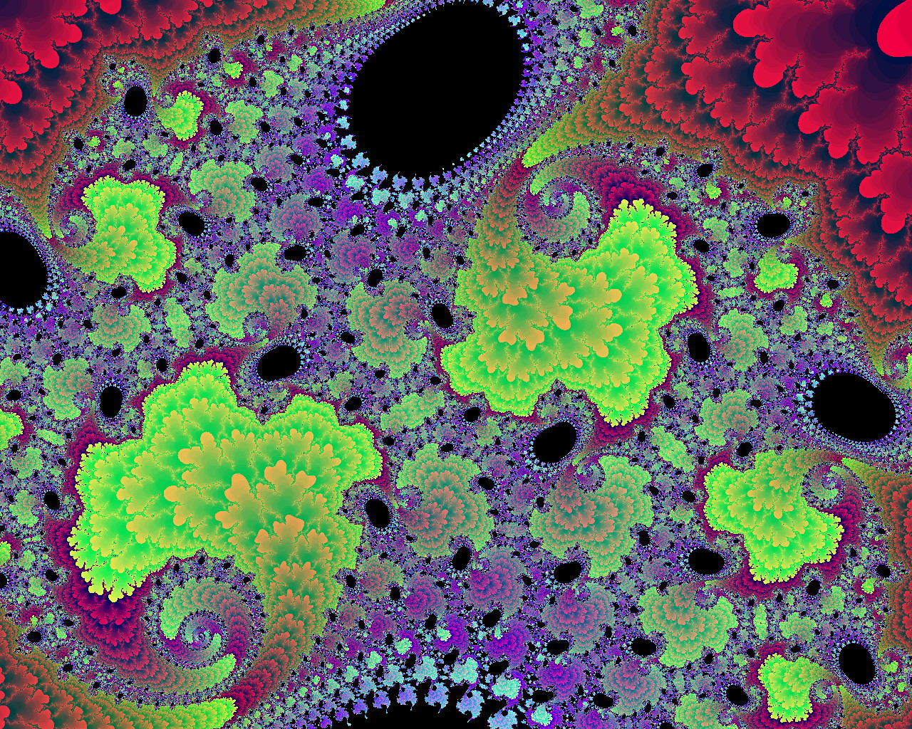
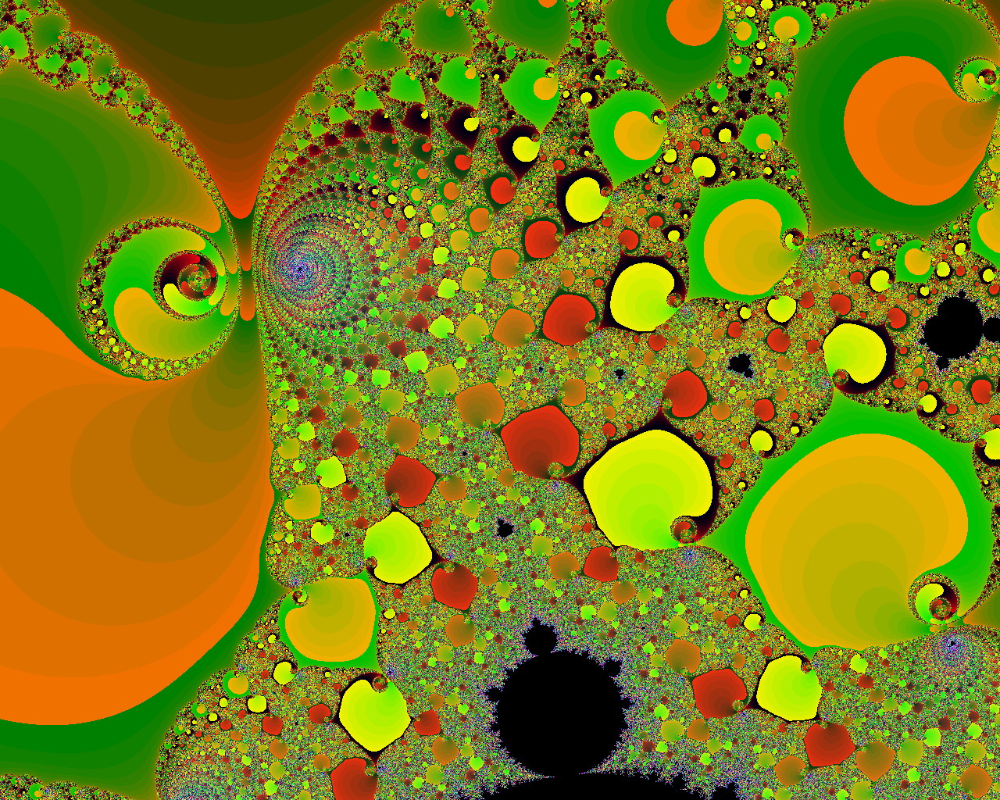
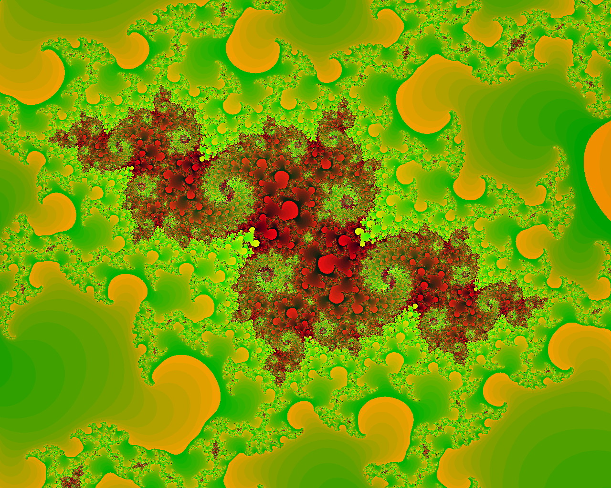
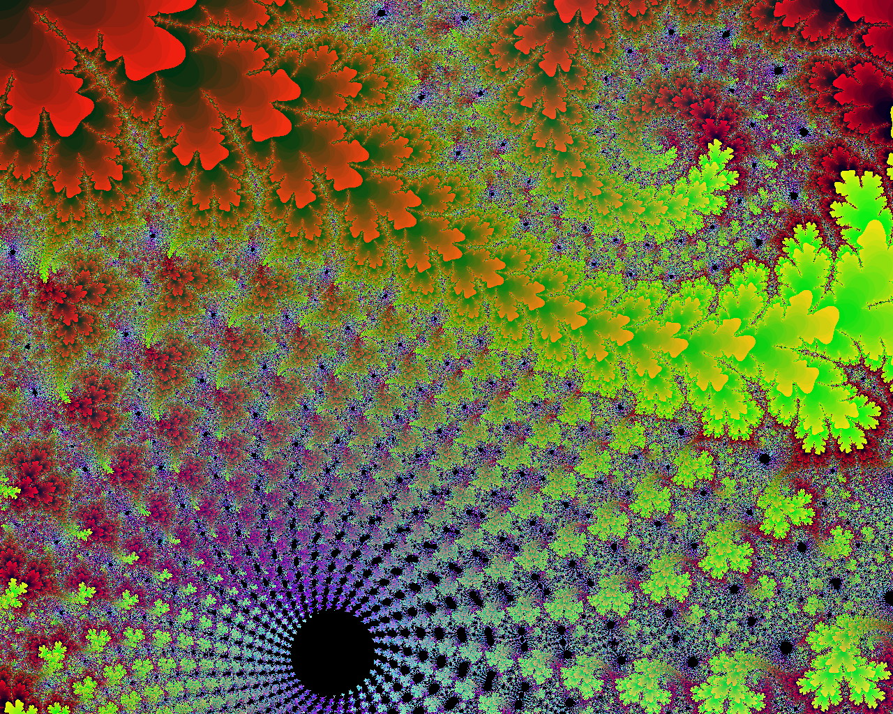
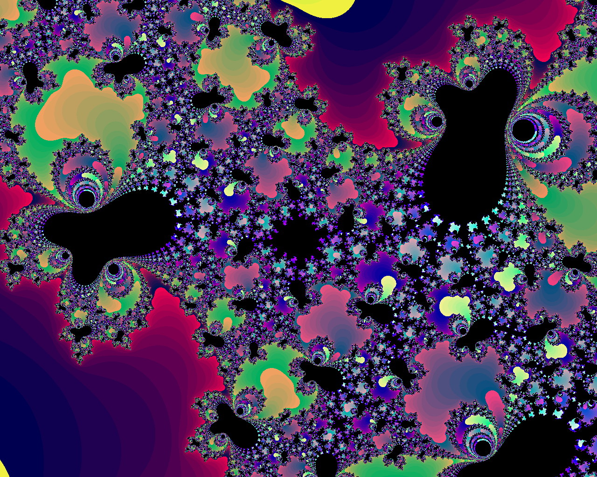

# Mandelbrot

## Description

This is an old, classic, simple [Mandelbrot](https://en.wikipedia.org/wiki/Mandelbrot_set) Fractal generator using [OpenGL](https://www.opengl.org/) and GLUT. I wrote this program to learn how to modify pixels using OpenGL.

## Build

Clone or download the software. Make sure the required OpenGL and GLUT headers/libraries are installed. Edit the Makefile to enable the OS specific variables of your platform and then type `make` to build. The build is known to work on MacOS (10.12) and Ubuntu (18.04.5).

## Usage

You can drag the left mouse button to zoom in on details. The zoom box is also drawn using OpenGL. A single left mouse button click centers the Mandelbrot around the mouse click. The right mouse button can undo  up to eight of the last zooms/centers. The 'R' key resets the generator to its default coordinates (in case they are no longer in the undo history). And the Escape key exits the application in classic GLUT style.

## Images

Date: 2021-01-19
